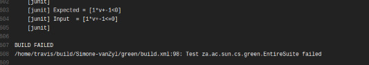

[](https://travis-ci.org/littleMissMae/green/builds)


# Tut 1: Setting up CI for GREEN 

### Task 1: Figuring out what was broken

**Acknowledgements:** This tut was successfully completed in a pair-programming endeavour with Simone-vanZyl as team *Genius and Qwen*

My github forked repo can be found here:

https://github.com/littleMissMae/green

**Steps to finding the failing test:**

1. Read through assignment tips

2. Force a Travis to build and test the repo => No fails were found

3. Uncomment the last test `test20` in  

   `green/test/za/ac/sun/cs/green/service/canonizer/SATCanonizerTest.java`

4. Repeating setp 2 => The build failed

5. This means that `test20` is the cause for failiure

6. Isolate which line in `test20` triggered the build fail by uncommenting lines 304 to 306:

   ```java
   public void test20() {
   	System.out.println("\n\n Test 20 \n\n");
   	IntConstant c1 = new IntConstant(2);
   	IntVariable v1 = new IntVariable("aa", 0, 99);
   	Operation o1 = new Operation(Operation.Operator.LE, c1, c1);
   	//Operation o2 = new Operation(Operation.Operator.LT, v1, c1);
   	//Operation o3 = new Operation(Operation.Operator.AND, o1, o2);
   	//check(o3, "(2<=2)&&(aa<2)", "1*v+-1<=0");
   }
   ```

7. Force another Travis build => found that the build was successful

8. Paired with Simone-vanZyl, and repeatedly uncommented and built the Travis file again.

9. We isolated line 306 as the cause of fail

10. We modified ``finalcheck`` to print out our expected and actual input:

    ```java
    private void finalCheck(String observed, String[] expected) {
    		String s0 = observed.replaceAll("[()]", "");
    		String s1 = s0.replaceAll("v[0-9]", "v");
    		SortedSet<String> s2 = new TreeSet<String>(Arrays.asList(s1.split("&&")));
    		SortedSet<String> s3 = new TreeSet<String>(Arrays.asList(expected));
    		System.out.println("\n\nExpected Output: " + s3.toString() + "\n\n Input Recieved: " + s2.toString() + "\n\n");
    		assertEquals(s3, s2);
    	}
    ```

    And identified the failing line in the error below:

    


11. We corrected line 306 in `test20` to 

    ```java
    check(o3, "(2<=2)&&(aa<2)", "1*v+-1<=0");
    ```

12. Run a Travis Build and we found that all tests passed

13. *For extra marks*, Buil #34 displays the formatted printing which hilights the FAILED test case
