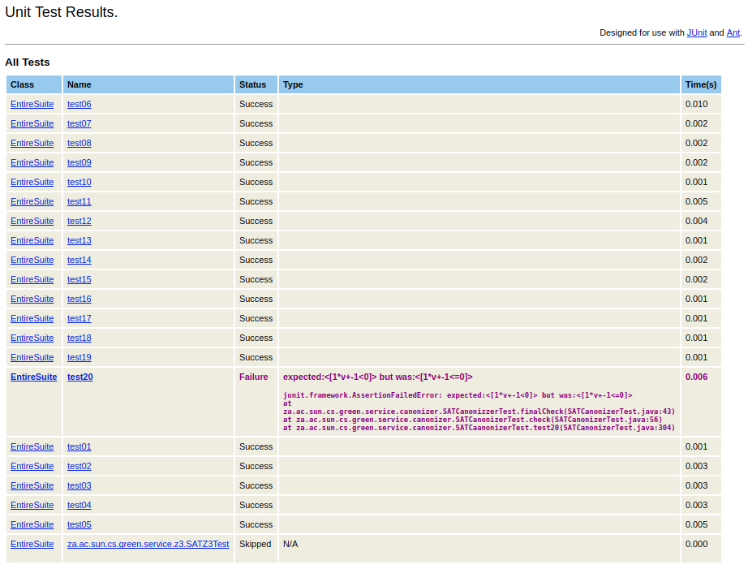

## <b> TASK 1: Fixing a broken test  

* Software Engineering 344 <br>
Lucia Daly - 20143516 <br> 30 July 2018

* <b> Link to my Github Account: <br> <git@github.com:LuciaDalySU/green.git>

---

### <b> Task Description:
Create a text file explaining how you figured out what was broken as well as a link to your repo on GitHub where you committed the change.


### :panda_face: <b> Answer:


> The following line of code in the `build.xml` indicated that all output files were stored in the bin directory.
``` xml
    <property name="output.dir" value="bin"/>
```
> I decided to modify the attribute of `haltonfailure` to `no`, as this will prevent the build from ending when one of the test cases fail.

> ``` xml
 <junit fork="yes" printsummary="withOutAndErr" haltonfailure = "no">
```
> After running `ant build` and `ant test`, I inspected the files located in the bin. <br>
> By opening the `TESTS-TestSuites.xml` in a browser, I could see that one of the test cases had failed. The following <b>Unit Test Results</b> indicated that for `test20` an output `<[1*v+-1<0]>` was expected but received `<[1*v+-1<=0]>`.

> 

> Thereafter, I modified `test20` in the `SATCanonizerTest.java` file to the following:
``` java
@Test
public void test20() {
	IntConstant c1 = new IntConstant(2);
	IntVariable v1 = new IntVariable("aa", 0, 99);
	Operation o1 = new Operation(Operation.Operator.LE, c1, c1);
	Operation o2 = new Operation(Operation.Operator.LT, v1, c1);
	Operation o3 = new Operation(Operation.Operator.AND, o1, o2);
	check(o3, "(2<=2)&&(aa<2)", "1*v+-1<=0");
}
```
> This resulted in a successful build, as all test cases passed.
